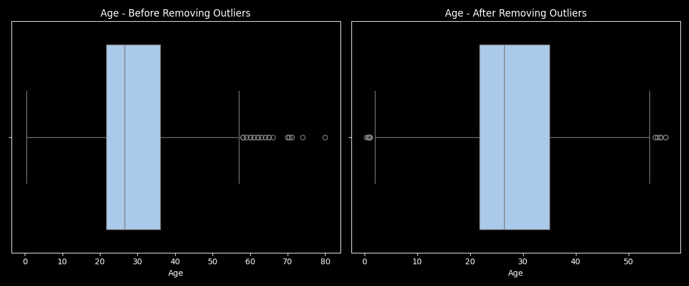
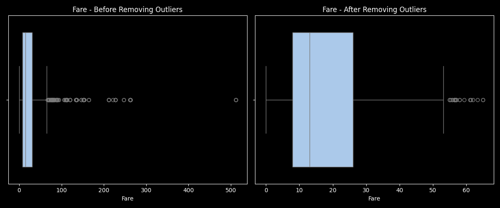
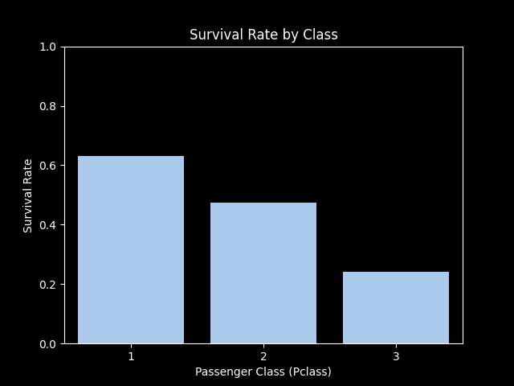
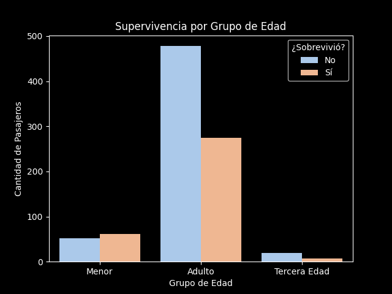

## ⚙️ Technologies Used

- Python 3
- Pandas
- Seaborn
- Matplotlib

---

## 🧼 Data Cleaning (`titanic_cleaning.py`)

This script performs the following steps:

- **Missing Values:**  
  Fills missing `Age` values based on `Pclass` and `Sex`.  
  Fills missing `Fare` values based on `Pclass`.  
  Fixes invalid or missing values in `Embarked`.

- **Duplicate Removal:**  
  Detects and removes duplicate rows (ignoring `PassengerId`).

- **Sex Inconsistencies:**  
  Fixes conflicts between passenger titles (e.g. “Mr”, “Mrs”) and their recorded gender.

- **Outlier Removal:**  
  Removes outliers in `Age` and `Fare` using the IQR method.

- **Categorization:**  
  Creates a new column `AgeGroup` classifying passengers as `Minor`, `Adult`, or `Senior`.

- **Saved Output:**  
  Cleaned dataset is saved as `titanic_clean.csv`.

---

## 📊 Data Visualizations (`titanic_visualization.py`)

### 1. Age Before & After Removing Outliers

Boxplots comparing the `Age` column before and after outlier removal using the IQR method.

---

### 2. Fare Before & After Removing Outliers

Same comparison but for the `Fare` column.

---

### 3. Age vs Fare (Scatter + Regression)

Shows a slight positive correlation — older passengers tend to pay higher fares.

---

### 4. Age Distribution by Class

Violin plot showing how age varies by passenger class.  
First class passengers tend to be older.

---

### 5. Correlation Heatmap

Visual representation of correlation values between numeric variables (`Age`, `Fare`, `Pclass`).

---

### 6. Passenger Class by Embark Port

Breakdown of how many passengers of each class boarded at each port.

---

### 7. Survival Rate by Class

Bar chart showing average survival rate across the three passenger classes.

---

### 8. Passenger Distribution by Age Group

Count of passengers by age category (`Minor`, `Adult`, `Senior`).

---

### 9. Survival by Age Group

Survival counts grouped by age categories.  
Gives insight into which groups had higher survival rates.

---

## 👤 About Me

**Santiago [Sketox]**  
Software Engineering student with a strong interest in data analytics and visualization. ⚙️📈

---

## 📬 Contact

Feel free to reach out via [GitHub](https://github.com/Sketox).
